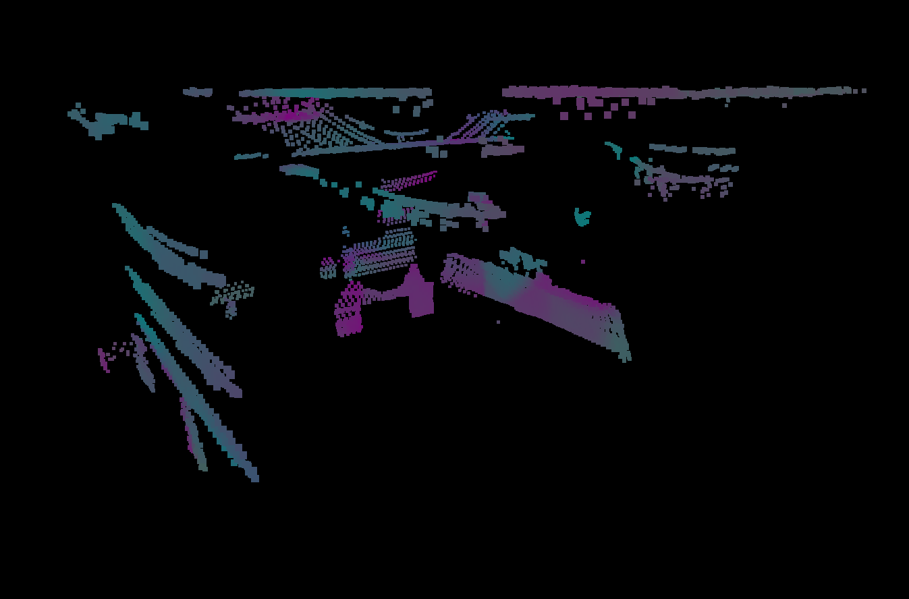
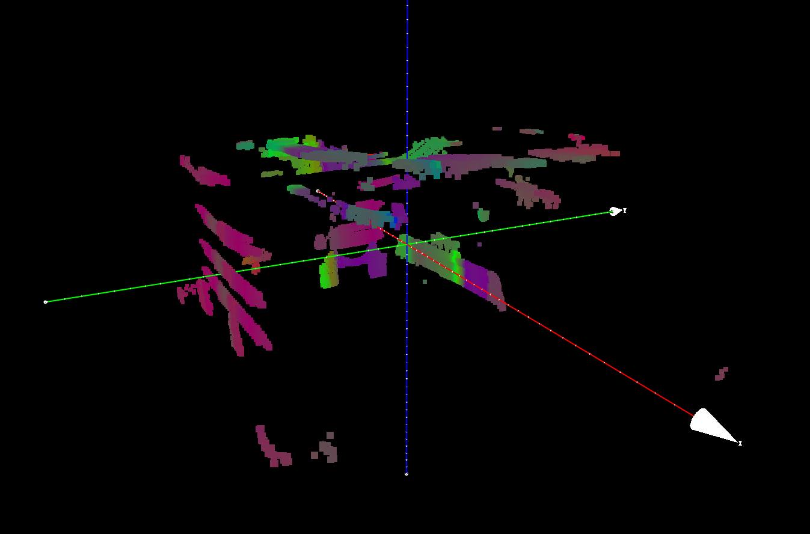
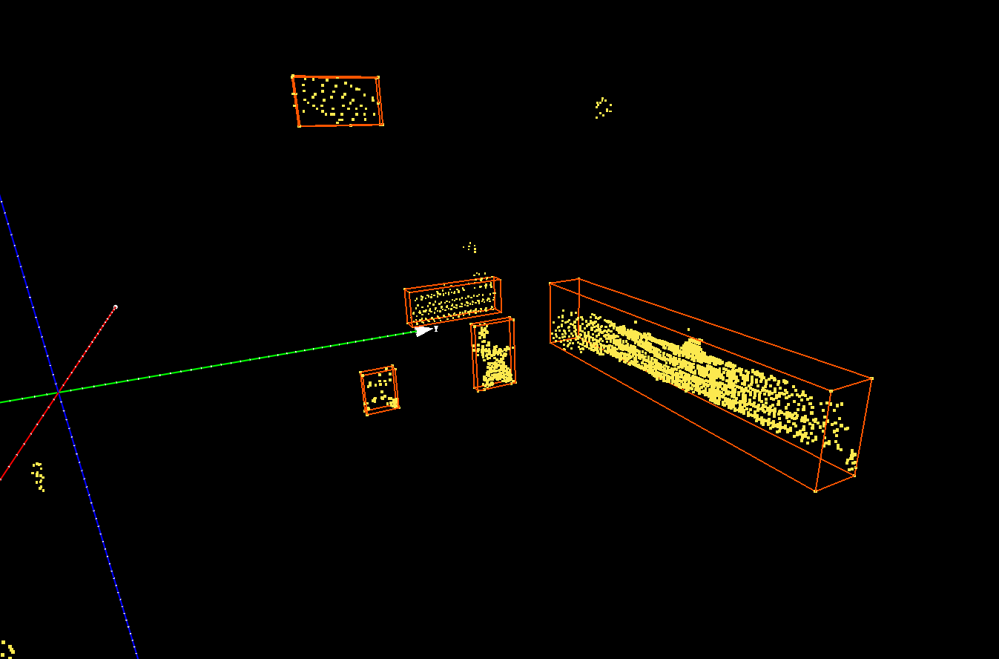

# 点云统计滤波方法及特征处理

## 目录结构

```txt
tree . -L 2
.
├── data            // 存放样本数据及处理结果
│   ├── dump
│   ├── kinth
│   └── output
├── pipeline2.ipynb // 统计滤波流程脚本
├── README.md
├── utils           // 所依赖的功能函数
│   ├── dump.py
│   ├── __init__.py
│   ├── __pycache__
│   └── tools.py
└── visual.ipynb    // 部分可视化脚本
```

## 预处理

- 半径滤波降噪
- 体素化降采样
- 格式转换

## 一阶段滤波

在这一阶段主要通过锚点及其邻域点所构成的集合进行 PCA 主轴比例分析，主轴的比例通过特征向量的特征值表示，代表在该轴向上点云投影的分散程度，因此若三个主轴分散程度大致相当，则可认为邻域点集合的几何特征大致是球形，否则就是平面型或者线型。通过将三个比例转换为对应的颜色分量以进行可视化或者过滤选择。

```python
eigvals, eigvecs = utils.pca_k(points[neighbour_idx_list], 3)
assert eigvals[0] >= eigvals[1] and eigvals[1] >= eigvals[2]
feat = np.array([
    (eigvals[0] - eigvals[1]) / (eigvals[0] + 1e-9),
    (eigvals[1] - eigvals[2]) / (eigvals[1] + 1e-9)
])
```



受到体素化降采样单位大小以及邻域搜索半径大小的影响，特征计算效果因半径而异，在上图中模拟桥梁部分点云的垂直线性特征被捕捉到呈现红色分量较多，其余位置如天花板和墙壁平面型特征强于线性特征，红色分量少。

在这一阶段主要是识别线性特征，但是无法确定线性的朝向，因此还需要额外的其他步骤继续过滤朝向不是向上的区域。

## 二阶段滤波

目前采用的方法是计算柱形邻域内的邻域点集合的 PCA 主轴与垂直向量 $(0,0,1)$ 的夹角，但是目前就效果而言不是很好，受到天花板和墙壁的影响，柱形邻域的主轴方向不能很好的体现邻域的垂直性，计划考虑使用其他的统计特征，比如邻域内点与锚点形成的向量术与垂直向量夹角的平均值。

```python
query = points[query_idx]
mask = (
    (np.abs(points[:, 0] - query[0]) < stage2_border / 2.0) &
    (np.abs(points[:, 1] - query[1]) < stage2_border / 2.0) &
    (np.abs(points[:, 2] - query[2]) < stage2_border)
)
mask[query_idx] = False
vicinity = points[mask]
if len(vicinity) < 3:
    stage2_feat_list.append(0.0)
    continue

feat = (1.0 - utils.sin_batch(points[mask] - query, np.array([0, 0, 1]))).mean()
```



图中红色与绿色分量较多，证明第一主轴和第二主轴都可能与垂直向量靠近，因为 PCA 主轴分析无法固定第一轴的向量，因此尽管三轴两两正交，但无法确定第一第二主轴的方向。

## ply 文件中的三维 AABB 包围盒显示

因为不方便安装 PCL 环境，也就没有办法做包围盒的渲染，所以还是需要本地实现一个包围盒算法和渲染方法比较好。我的想法是使用基于格雷码的顺序连线完成包围框的顶点连线，这样不会出现对角线连线的错误，并且这种方法是普适的，也适用于 OBB 类型的有向包围盒。这种本地渲染并将信息直接保存到文件中的好处是，后续如果需要在其他机器上查看结果不需要配置繁杂的开发环境，直接下一个可用的点云可视化软件就行了。


